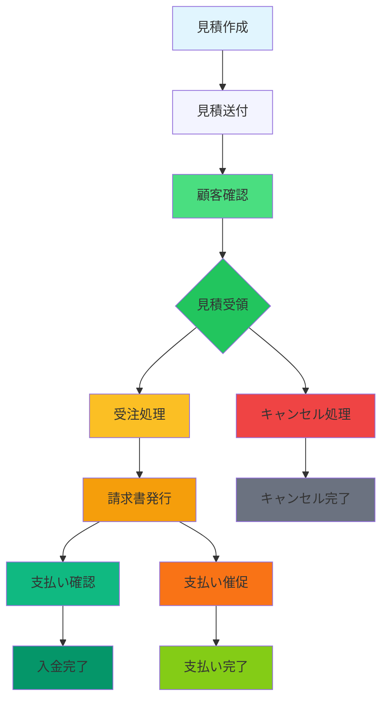

# 見積もり管理システム - 2つの格納先に関する設計考察

## 🤔 なぜ2つの格納先が必要か？

### 📋 ビジネスプロセスの分析

#### 1. **印刷業界の標準的な分業**
```
見積作成 → 見積送付 → 見積受領 → 受注処理 → 製造・発送 → 請求書発行 → 入金確認
```

#### 2. **支払いサイクルの多様性**
```
【ケース1】締め払い
- 納品検収時に現金払い
- 請求書発行時点で支払い完了
- 1回の支払いで完結

【ケース2】分割払い
- 納品時に一部前払い
- 納品時に残金を請求書で支払い
- 複数回の支払いが必要

【ケース3】クレジット払い
- カード決済時に支払い完了
- 請求書とは別の支払いサイクル
- 与信管理が必要
```

#### 3. **請求書と見積書の違い**
```
見積書: 価格提示の文書（法的拘束力なし）
請求書: 支払い要求の文書（法的拘束力あり）
```

### 🏢 2つの格納先が必要な理由

#### **理由1: 支払い管理の分離**
- **見積書**: 価格提示用 → 顧客確認用
- **請求書**: 支払い要求用 → 経理部用
- **保管場所**: 見積書は営業部、請求書は経理部

#### **理由2: 監査証跡の確保**
- **見積書**: 顧客との交渉記録
- **請求書**: 支払い履歴としての証跡
- **監査対応**: 両文書の保管が義務

#### **理由3: 顧客対応の分業化**
- **見積書**: 営業担当者が顧客対応
- **請求書**: 経理担当者が支払い管理
- **役割分担**: 明確な責任区分

#### **理由4: キャンセル対応の柔軟性**
```
【見積キャンセル】
- 営業部で対応
- 顧客にキャンセル通知
- 請求書は未発行

【請求書キャンセル後】
- 既に発行済みの請求書を無効化
- 経理処理が必要
- キャンセル手数料の請求も可能
```

#### **理由5: 法務・コンプライアンス要件**
```
- 会計法: 取引の証跡保存が義務
- 税法: 課税文書の保存期間が規定
- 消費税: 課税仕様書の保管が必須
- 内部統制: 文書管理プロセスの明確化
```

### 💡 最適なシステム設計

#### **データベース設計**
```sql
-- 見積書テーブル
CREATE TABLE estimates (
  id UUID PRIMARY KEY,
  customer_id UUID REFERENCES customers(id),
  estimate_number TEXT UNIQUE,
  issue_date DATE,
  valid_until DATE,
  total_amount DECIMAL,
  tax_amount DECIMAL,
  status TEXT, -- 'draft', 'sent', 'accepted', 'rejected', 'expired'
  file_path TEXT,
  created_by UUID REFERENCES users(id),
  created_at TIMESTAMP DEFAULT NOW()
);

-- 請求書テーブル  
CREATE TABLE invoices (
  id UUID PRIMARY KEY,
  estimate_id UUID REFERENCES estimates(id),
  invoice_number TEXT UNIQUE,
  issue_date DATE,
  due_date DATE,
  total_amount DECIMAL,
  tax_amount DECIMAL,
  status TEXT, -- 'draft', 'sent', 'paid', 'overdue', 'cancelled'
  payment_method TEXT,
  paid_at TIMESTAMP,
  created_by UUID REFERENCES users(id),
  created_at TIMESTAMP DEFAULT NOW()
);
```

#### **ワークフロー設計**


### 🔧 システム機能要件

#### **見積もり管理機能**
1. **見積書作成**
   - AI自動生成機能
   - テンプレート選択
   - PDF出力機能
   - メール送付機能

2. **見積書一覧**
   - ステータス別表示（下書き、送付済み、受領済み、期限切れ）
   - 顧客情報との連携
   - 検索・フィルター機能
   - 並び替え機能

3. **請求書管理機能**
1. **請求書作成**
   - 見積書からの変換機能
   - 請求書番号の自動採番
   - 支払い条件の設定

2. **請求書一覧**
   - 支払い状況別表示
   - 遅延管理
   - 入金予定日の管理
   - 請求書PDFの出力

### 📊 期待される効果

#### **業務効率の向上**
- 営業と経理の業務分離
- 各担当者の役割が明確化
- 文書管理のプロセスが標準化

#### **リスク管理の強化**
- 支払い状況のリアルタイム把握
- キャンセル対応の迅速化
- 監査証跡の確保

#### **顧客満足度の向上**
- 請求書の適切な発行タイミング
- 支払い方法の選択肢の拡大
- 丁寧な請求書の発行

### 🎡 結論

2つの格納先が必要なのは、**印刷業界の標準的なビジネスプラクティス**と**法務・コンプライアンス要件**を満たすためです。

- **見積書**: 価格交渉の記録
- **請求書**: 支払い要求の証跡

この分業により、よりプロフェッショナルで効率的な見積もり管理システムが実現できます。
